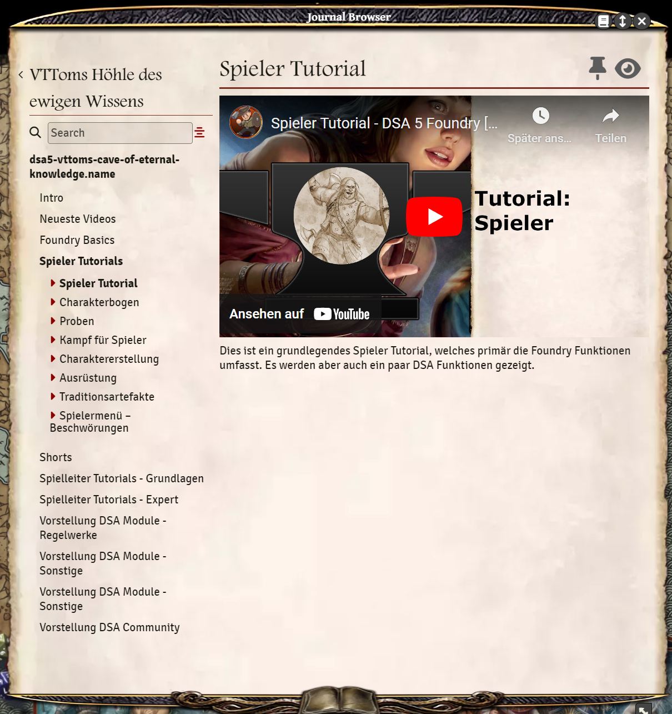

# dsa5-vttoms-cave-of-eternal-knowledge
DSA 5 Journal Modul mit Videos und Anleitungen zu Foundry DSA  
(A module for implementing my german youtube tutorials directly into Foundry VTT)

Dieses Modul fügt dem Journal Browser eine strukturierte Übersicht meiner Youtube Videos hinzu.  
Ihr könnt also mit diesem Modul die Tutorials über den JournalBrowser aufrufen und direkt in Foundry abspielen.

## Installtion
Direkt über die Foundry Modul-Suche

## Voraussetzungen
DSA/TDE 5th Edition System ab Version 5.0.0  
Foundry VTT Version 11.299

## Support
Wollt ihr mich und meine Arbeit unterstützen, spendiert mir einen Kaffee.  

